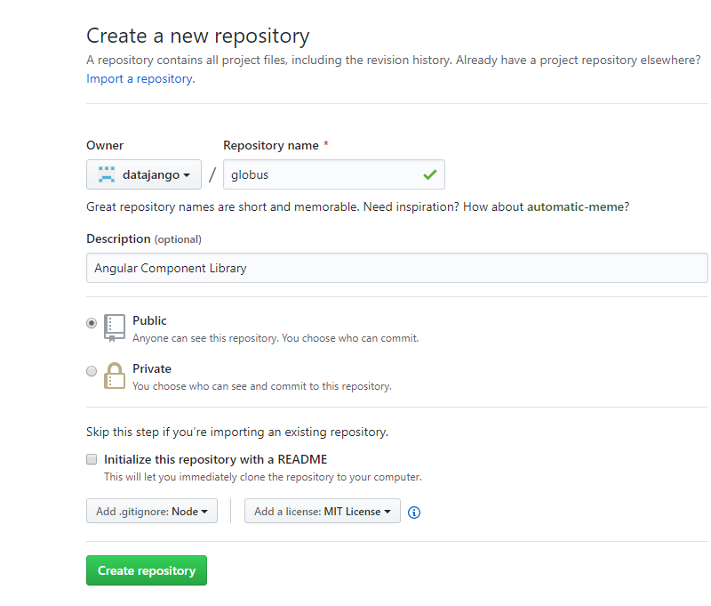
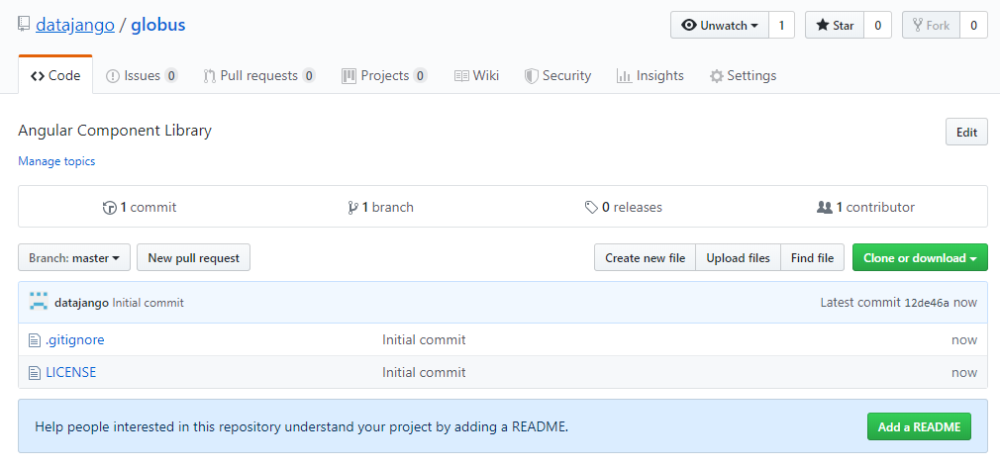
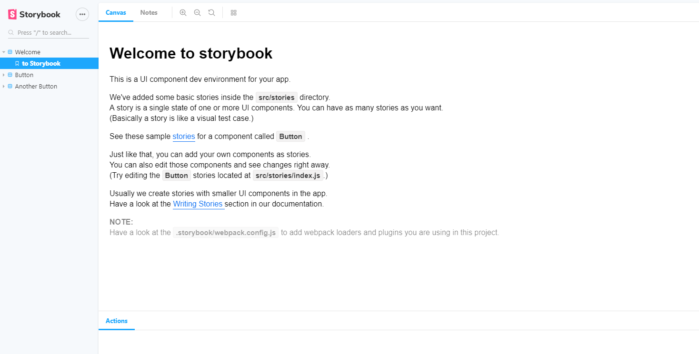
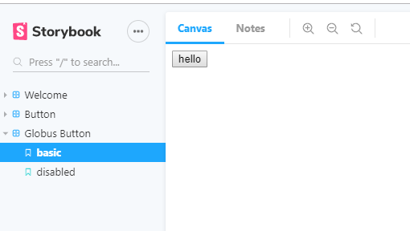
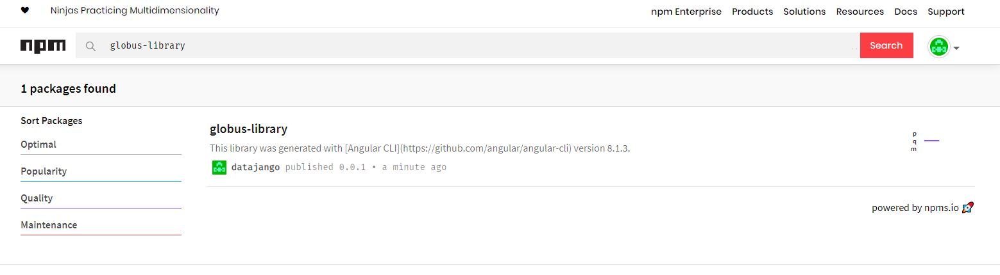
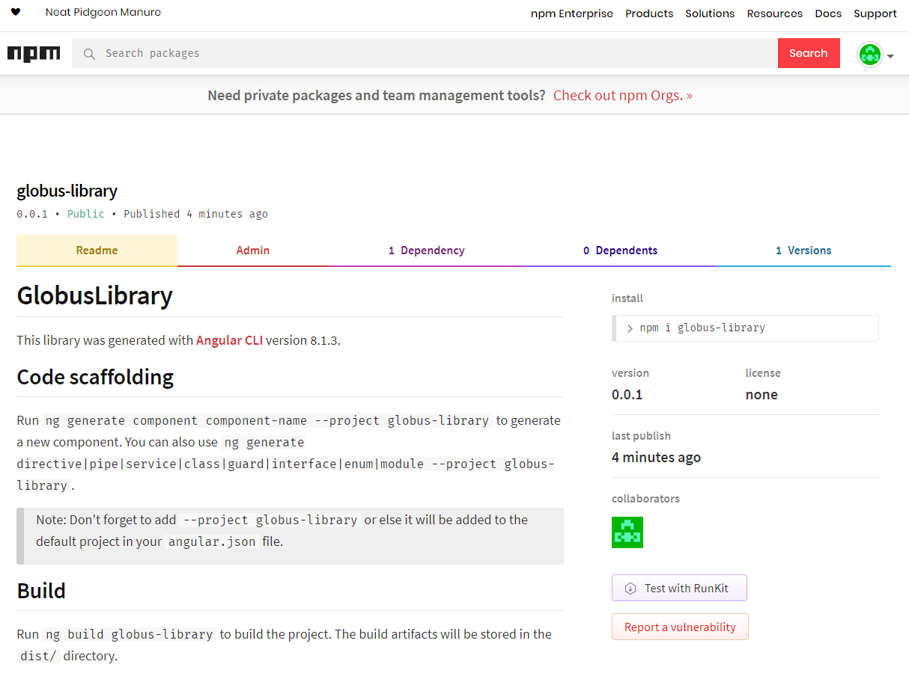
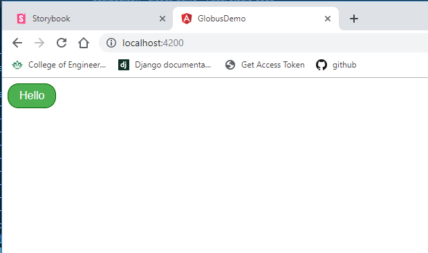

# Globus - Angular Component Library

<p align="center">
    
</p>


## Creation Steps

1. Create new GitHub Repo

<p align="center">
    
</p>

2. Default GitHub Repo

<p align="center">
    
</p>

3. Clone the repo locally.

```
git clone git@github.com:datajango/globus.git
Cloning into 'globus'...
remote: Enumerating objects: 4, done.
remote: Counting objects: 100% (4/4), done.
remote: Compressing objects: 100% (4/4), done.
remote: Total 4 (delta 0), reused 0 (delta 0), pack-reused 0
Receiving objects: 100% (4/4), done.
```

4. Open the cloned folder in a text editor, I will be using [Micrsoft Visual Studio Code](https://code.visualstudio.com/docs#vscode)

5. create a new Angular project using the CLI

    1. You can test the commend by adding the --dryRun=true option
        ```
        ng new globus --create-application=false --style=scss --routing=false --dryRun=true
        ```
    2. When you ready, execute the below
        ```
        ng new globus --create-application=false --style=scss --routing=false
        ```
    3. Cd into the new folder
        ```
        cd globus
        ```
    4. Next create a Library
        ```
        ng generate library globus-library --dryRun=true
        ng generate library globus-library
        ```
        a prefix could have been applied
        ```
        ng generate library globus-library --prefix=glb
        ```
## Install Story Book

1. Install Story Book using the NPX command

    ```
    npx -p @storybook/cli sb init --type angular
    ```

## Startup Story Book    

1. Start storybook

    ```
    npm run storybook
    ```

1. A local webpack server will be started on port 6006. [local](http://localhost:6006)

    

    ```
    Starting type checking service...
    Using 1 worker with 2048MB memory limit
    webpack built c4364c5d4b9d2f4b6656 in 28656ms
    ╭─────────────────────────────────────────────────╮
    │                                                 │
    │   Storybook 5.2.6 started                       │
    │   35 s for manager and 37 s for preview         │
    │                                                 │
    │   Local:            http://localhost:6006/      │
    │   On your network:  http://10.7.51.249:6006/    │
    │                                                 │
    ╰─────────────────────────────────────────────────╯
    ```

## Creating the first Component

1. Create a new button
    ```
    ng generate component button --project globus-library --dryRun=true
    ng generate component button --project globus-library
    ```
1. Edit .\globus\projects\globus-library\src\lib\button\button.component.html
    ```html
    <button (click)="onclick()">
    {{text}}
    </button>
    ```
1. Edit .\globus\projects\globus-library\src\lib\button\button.component.ts
    ```typescript
    import { Component, OnInit, Input, Output, EventEmitter } from '@angular/core';

    @Component({
    selector: 'glb-button',
    templateUrl: './button.component.html',
    styleUrls: ['./button.component.css']
    })
    export class ButtonComponent implements OnInit {

        @Input() text: string;
        @Output() click: EventEmitter<void> = new EventEmitter();

        constructor() { }

        ngOnInit() {
        }

        onclick(){
            this.click.emit();
        }
    }
    ```
1. Add a storybbook story for the Button component

    Storybook is all about writing stories. A story usually contains a single state of one component, almost like a visual test case.

    ```typescript
    import { storiesOf } from '@storybook/angular';
    import { ButtonComponent } from 'lib-button';

    storiesOf('button', module)
    .add('basic', () => ({
        component: ButtonComponent,
        props: {
        text: 'hello'
        }
    }))
    .add('disabled', () => ({
        component: ButtonComponent,
        props: {
        text: 'disabled',
        disabled: true
        }
    }));
    ```

    

1. Change to SCSS    

    1. Install node-sass

        ```
        npm install -dev node-sass
        ```

    1. Install some more Storybook packages

        ```
        npm install @storybook/addon-storysource --save-dev
        npm install to-string-loader --save-dev
        npm install css-loader --save-dev
        ```

    1. Change .\globus\projects\globus-library\src\lib\button\button.component.ts
    
        ```typescript
        import { Component, OnInit, Input, Output, EventEmitter } from '@angular/core';

        @Component({
        selector: 'glb-button',
        templateUrl: './button.component.html',
        styleUrls: ['./button.component.scss']
        })
        export class ButtonComponent implements OnInit {

            @Input() text: string;
            @Input() disabled: boolean = False;
            @Output() click: EventEmitter<void> = new EventEmitter();

            constructor() { }

            ngOnInit() {
            }

            onclick(){
                this.click.emit();
            }
        }
        ```
    1. Add some fancy CSS styling
        ```scss    
        $color-foreground: white;
        $color-background: #4CAF50;
        $color-border: darkgreen;

        .button {
            background-color: $color-background;
            border: 1px solid $color-border; 
            color: $color-foreground;
            padding: 8px 16px;
            text-align: center;
            text-decoration: none;
            display: inline-block;
            font-size: 16px;
            border-radius: 16px;

            -webkit-transition-duration: 0.4s; /* Safari */
            transition-duration: 0.4s;    

            &:not(.disabled):hover {
                background-color: $color-foreground;
                color: $color-background;
            }       

            &.disabled {
                opacity: 0.6;
                cursor: not-allowed;
            }    
        }
        ```

    1. Add the new component to the exports section of .\globus\projects\globus-library\src\lib\globus-library.module.ts

        ```typescript
        import { NgModule } from '@angular/core';
        import { BrowserModule } from '@angular/platform-browser';
        import { GlobusLibraryComponent } from './globus-library.component';
        import { ButtonComponent } from './button/button.component';


        @NgModule({
        declarations: [GlobusLibraryComponent, ButtonComponent],
        imports: [
            BrowserModule 
        ],
        exports: [GlobusLibraryComponent, ButtonComponent]
        })
        export class GlobusLibraryModule { }
        ```

## Creating a NPM package

1. Build the Globus library

    ```
    cd .\globus\globus
    ng build globus-library

    Building Angular Package

    ------------------------------------------------------------------------------
    Building entry point 'globus-library'
    ------------------------------------------------------------------------------
    Compiling TypeScript sources through ngc
    Bundling to FESM2015
    Bundling to FESM5
    Bundling to UMD
    Minifying UMD bundle
    Copying declaration files
    Writing package metadata
    Built globus-library

    ------------------------------------------------------------------------------
    Built Angular Package!
    - from: C:\dev\globus\globus\projects\globus-library
    - to:   C:\dev\globus\globus\dist\globus-library
    ------------------------------------------------------------------------------
    ```

1. Pack the library into a tarball

    1. Add to package.json

        ```
        "scripts": {
            ...
            "pack": "cd dist/globus-library && npm pack && npm link",
            "link": "cd dist/globus-library && npm link",
            "publish": "cd dist/globus-library && npm publish"
            ...
        }
        ```

    1. Run the pack command
    
        ```        
        npm run pack
        ```

        Output:
        ```
        > globus@0.0.0 pack C:\dev\globus\globus
        > cd dist/globus-library && npm pack

        npm notice
        npm notice package: globus-library@0.0.1
        npm notice === Tarball Contents ===
        npm notice 3.0kB esm2015/lib/button/button.component.js
        npm notice 3.3kB esm5/lib/button/button.component.js
        npm notice 1.6kB esm2015/lib/globus-library.component.js
        npm notice 1.9kB esm5/lib/globus-library.component.js
        npm notice 956B  esm2015/globus-library.js
        npm notice 956B  esm5/globus-library.js
        npm notice 3.8kB fesm2015/globus-library.js
        npm notice 4.6kB fesm5/globus-library.js
        npm notice 2.0kB esm2015/lib/globus-library.module.js
        npm notice 2.3kB esm5/lib/globus-library.module.js
        npm notice 1.4kB esm2015/lib/globus-library.service.js
        npm notice 1.6kB esm5/lib/globus-library.service.js
        npm notice 5.3kB bundles/globus-library.umd.js
        npm notice 2.0kB bundles/globus-library.umd.min.js
        npm notice 1.0kB esm2015/public-api.js
        npm notice 1.0kB esm5/public-api.js
        npm notice 2.9kB globus-library.metadata.json
        npm notice 582B  package.json
        npm notice 2.4kB fesm2015/globus-library.js.map
        npm notice 2.4kB fesm5/globus-library.js.map
        npm notice 2.5kB bundles/globus-library.umd.js.map
        npm notice 2.5kB bundles/globus-library.umd.min.js.map
        npm notice 1.1kB README.md
        npm notice 256B  lib/button/button.component.d.ts
        npm notice 152B  lib/globus-library.component.d.ts
        npm notice 155B  globus-library.d.ts
        npm notice 47B   lib/globus-library.module.d.ts
        npm notice 68B   lib/globus-library.service.d.ts
        npm notice 142B  public-api.d.ts
        npm notice === Tarball Details ===
        npm notice name:          globus-library
        npm notice version:       0.0.1
        npm notice filename:      globus-library-0.0.1.tgz
        npm notice package size:  9.7 kB
        npm notice unpacked size: 51.9 kB
        npm notice shasum:        50e28ed92163e9ef027f8248c7ac517ce5f44b1f
        npm notice integrity:     sha512-eR3oiQlcJgRvr[...]/4nIGhio3vIPg==
        npm notice total files:   29
        npm notice
        globus-library-0.0.1.tgz
        ```
  
    1. Run the link command
    
        ```        
        npm run link
        ```

        output:
        ```       
        > globus@0.0.0 link C:\dev\globus\globus
        > cd dist/globus-library && npm link

        npm notice created a lockfile as package-lock.json. You should commit this file.
        npm WARN globus-library@0.0.1 requires a peer of @angular/common@^8.1.3 but none is installed. You must install peer dependencies yourself.
        npm WARN globus-library@0.0.1 requires a peer of @angular/core@^8.1.3 but none is installed. You must install peer dependencies yourself.
        npm WARN globus-library@0.0.1 No repository field.
        npm WARN globus-library@0.0.1 No license field.

        added 1 package from 1 contributor and audited 1 package in 6.87s
        found 0 vulnerabilities
        ```

1. Create an NPM account at command line or goto [npmjs](https://www.npmjs.com/)

    ```
    npm adduser
    ```

1. Login to npm on the command line

    ```
    npm login
    ```

1. Publish the library to npmjs.com

    ```        
    npm run publish
    ```

    Output:
    ```
    > globus@0.0.0 publish C:\dev\globus\globus
    > cd dist/globus-library && npm publish

    npm notice
    npm notice package: globus-library@0.0.1
    npm notice === Tarball Contents ===
    npm notice 3.0kB  esm2015/lib/button/button.component.js
    npm notice 3.3kB  esm5/lib/button/button.component.js
    npm notice 1.6kB  esm2015/lib/globus-library.component.js
    npm notice 1.9kB  esm5/lib/globus-library.component.js
    npm notice 956B   esm2015/globus-library.js
    npm notice 956B   esm5/globus-library.js
    npm notice 3.8kB  fesm2015/globus-library.js
    npm notice 4.6kB  fesm5/globus-library.js
    npm notice 2.0kB  esm2015/lib/globus-library.module.js
    npm notice 2.3kB  esm5/lib/globus-library.module.js
    npm notice 1.4kB  esm2015/lib/globus-library.service.js
    npm notice 1.6kB  esm5/lib/globus-library.service.js
    npm notice 5.3kB  bundles/globus-library.umd.js
    npm notice 2.0kB  bundles/globus-library.umd.min.js
    npm notice 1.0kB  esm2015/public-api.js
    npm notice 1.0kB  esm5/public-api.js
    npm notice 2.9kB  globus-library.metadata.json
    npm notice 582B   package.json
    npm notice 2.4kB  fesm2015/globus-library.js.map
    npm notice 2.4kB  fesm5/globus-library.js.map
    npm notice 2.5kB  bundles/globus-library.umd.js.map
    npm notice 2.5kB  bundles/globus-library.umd.min.js.map
    npm notice 1.1kB  README.md
    npm notice 20.5kB globus-library-0.0.1.tgz
    npm notice 256B   lib/button/button.component.d.ts
    npm notice 152B   lib/globus-library.component.d.ts
    npm notice 155B   globus-library.d.ts
    npm notice 47B    lib/globus-library.module.d.ts
    npm notice 68B    lib/globus-library.service.d.ts
    npm notice 142B   public-api.d.ts
    npm notice === Tarball Details ===
    npm notice name:          globus-library
    npm notice version:       0.0.1
    npm notice package size:  31.4 kB
    npm notice unpacked size: 72.4 kB
    npm notice shasum:        57552f476c527bcad75d623fc05eef6de83a6ba9
    npm notice integrity:     sha512-+NmdMVdbptIxc[...]0y4mTcoEooQpA==
    npm notice total files:   30
    npm notice
    + globus-library@0.0.1

    ```

1. Verify that that the package was published to nmpjs.ocom by searching for it.

    

1. NPMJS should display a very basic package information details page.

    


## Publishing a New Version Instructions 

    1. Bump the version 
    
        ```
        cd dist
        npm version 0.0.2
        ```

    or 

    1. Edit .\globus\package.json

        ```json
        {
            "name": "globus",
            "version": "0.0.2",
            "scripts": {
                "ng": "ng",
            ...
        ```    

    1. Cd to the project folder
        ```
        cd .\globus\globus
        ```
    1. Build the library, --prod is not required anymore ad the AOT version is built by default.
        ```
        ng build globus-library    
        ```

    1. npm pack

        ```
        npm run pack
        ```
    
    1. npm link
    
        ```        
        npm run link
        ```
        
    1. npm publish (make sure yoru logged in) first

        ```
        npm run publish
        ```

    1. In an applicatiopn that uses the Globus Library do a npm update

        1. First find outdated packages
            ```
            npm outdated
            ```
        
        1. Do a npm install @latest to make sure you get teh latest version of the Globus Package
            
            ```
            npm install globus-library@latest --save            
            ```


## Using the Globus NPM package in a new Angular Project

1. create a new Angular project

    ```
    ng new globus-demo
    ```


1. cd into the newly create folder

    ```
    cd globus-demo    
    ```

1. add the globus-library in .\src\app\app.module.ts

    ```
    import { BrowserModule } from '@angular/platform-browser';
    import { NgModule } from '@angular/core';

    import { AppRoutingModule } from './app-routing.module';
    import { AppComponent } from './app.component';
    import { GlobusLibraryModule } from  'globus-library';

    @NgModule({
    declarations: [
        AppComponent,    
    ],
    imports: [
        BrowserModule,
        AppRoutingModule,
        GlobusLibraryModule    
    ],
    providers: [],
    bootstrap: [AppComponent]
    })
    export class AppModule { }
    ```

1. It Works!

<h1>The Globus Library has been successfully consumed</h1>


